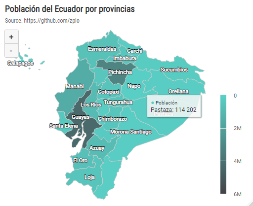
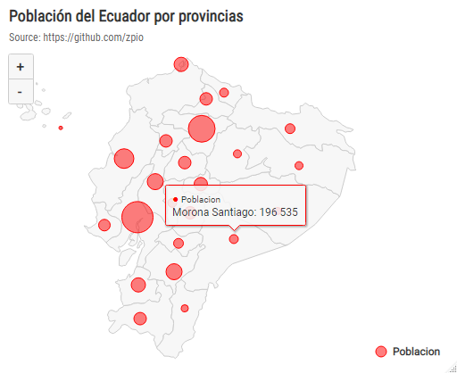
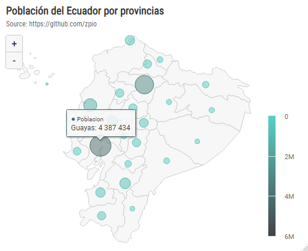

🦄 Graficando en R el Mapa del Ecuador
============================================

Apuntes de graficación del mapa del Ecuador con la libreria **highcharter**.


🔥 Cargamos las librerias necesarias
-------------------------------------
```r
library(tidyverse)
library(jsonlite)
library(httr)
library(highcharter)
```

🔥 Cargar la data del mapa en objeto lista de R
-----------------------------------------

Cargamos el archivo .json y lo convertimos en formato lista de R.

```r
# En formato lista
mapa.ec <- 
  httr::GET("https://raw.githubusercontent.com/zpio/mapa-ecuador/main/ec-all.geo.json") %>% 
  httr::content(type = 'text') %>% 
  jsonlite::fromJSON(simplifyVector = FALSE)
```

🔥 Cargar la data del mapa en objeto data frame de R
-----------------------------------------
Cargamos el archivo .json pero lo convertimos en data frame de R que lo usaremos para extraer las provincias.

```r
# En formato data frame
mapa_ec <- 
  jsonlite::fromJSON("https://raw.githubusercontent.com/zpio/mapa-ecuador/main/ec-all.geo.json") %>% 
  as.data.frame()
```

🔥 Crear un data frame de las provincias con sus coordenadas 
-----------------------------------------
Del data frame `mapa_ec` extraemos las provincias y creamos otro data frame de provincias con sus respectivas coordenadas de centroides.

```r
provincias <- 
  data.frame(name= mapa_ec$features.properties$name,
             lon = mapa_ec$features.properties$longitude,
             lat = mapa_ec$features.properties$latitude) %>% 
  filter(name != is.na(name)) %>% 
  mutate(across(everything(), as.character)) %>% 
  mutate(across(c(lon, lat), as.numeric))
```

🔥 Cargamos la población 2020 del Ecuador por provincias
-----------------------------------------

```r
# Poblacion Ecuador por provincia 2020
pop_prov <- 
  read_csv('https://raw.githubusercontent.com/zpio/mapa-ecuador/main/pop_prov2020.csv')
```

🔥 Gráfica de mapa de la Población del Ecuador 
-----------------------------------------

**Mapa con colores continuos**

```r
# Grafica con colores continuos
highchart() %>% 
  hc_add_series_map(map = mapa.ec,
                    df = pop_prov, 
                    name= 'Población',
                    value = "Poblacion2020",
                    joinBy = c("name", "Provincia"),
                    dataLabels = list(enabled = TRUE, 
                                      format = '{point.name}'),
                    states = list(hover = list(color='#04635b'))
  ) %>% 
  hc_mapNavigation(enabled = TRUE) %>% 
  hc_add_theme(hc_theme_smpl()) %>% 
  hc_colorAxis(minColor = "#5ad1c7", maxColor = "#434348") %>% 
  hc_title(text = "Mapa Poblacional del Ecuador") %>%
  hc_subtitle(text = "Source: zpio.com") %>% 
  hc_legend(layout= 'vertical',
            align= 'right',
            verticalAlign= 'bottom')
```




**Agregando bubbles al mapa**

Primero hacemos un join con las coordenadas de las provincias y la población

```r
prov_lat_lon <- provincias %>% 
  left_join(pop_prov, by = c('name'='Provincia')) %>% 
  rename(z = Poblacion2020)
```

```r
# Mapa con 'bubbles' de un solo color

highchart(type = "map") %>%
  hc_add_series(mapData = mapa.ec, 
                showInLegend = FALSE) %>% 
  hc_add_series(
    data = prov_lat_lon, 
    type = "mapbubble",
    name = "Poblacion", 
    minSize = "1%",
    maxSize = "10%",
    color = 'red'
  ) %>% 
  hc_mapNavigation(enabled = TRUE) %>% 
  hc_add_theme(hc_theme_smpl()) %>% 
  hc_title(text = "Población del Ecuador por provincias") %>%
  hc_subtitle(text = "Source: https://github.com/zpio") %>% 
  hc_legend(layout= 'vertical',
            align= 'right',
            verticalAlign= 'bottom')
```




```r
# Grafica con 'bubbles' de color continuo

highchart(type = "map") %>%
  hc_add_series(mapData = mapa.ec, showInLegend = FALSE) %>% 
  hc_add_series(
    data = prov_lat_lon, 
    type = "mapbubble",
    name = "Poblacion", 
    minSize = "1%",
    maxSize = "10%"
  ) %>% 
  hc_mapNavigation(enabled = TRUE) %>% 
  hc_add_theme(hc_theme_smpl()) %>% 
  hc_colorAxis(minColor = "#5ad1c7", maxColor = "#434348") %>% 
  hc_title(text = "Población del Ecuador por provincias") %>%
  hc_subtitle(text = "Source: https://github.com/zpio") %>% 
  hc_legend(layout= 'vertical',
            align= 'right',
            verticalAlign= 'bottom')
```



